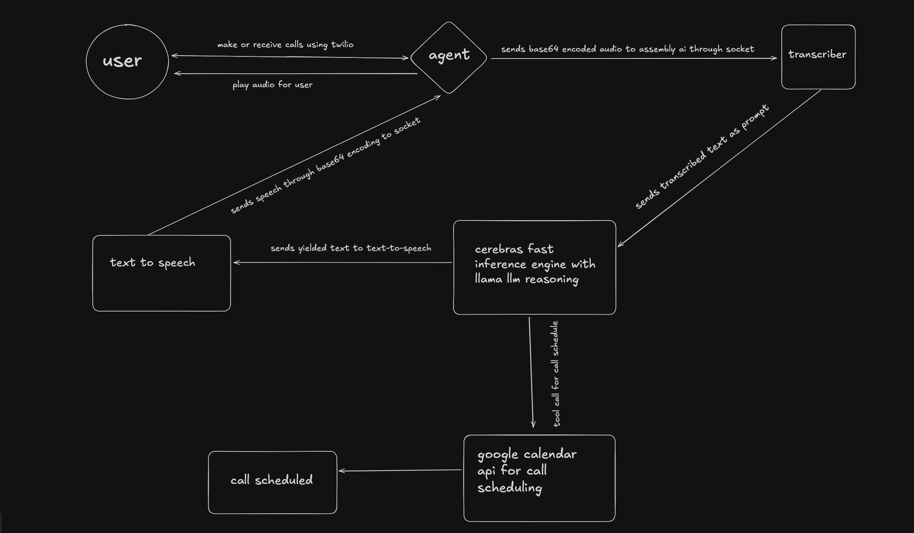

<h1 align="center" id="title">Cally AI</h1>

<p align="center"></p>

<p id="description">A smart and reliable AI-powered call agent designed to handle patient calls and seamlessly schedule dental appointments.</p>

<h2>🚀 Demo</h2>

[d](d)

<h2>Project Screenshots:</h2>



  
  
<h2>🧐 Features</h2>

Here're some of the project's best features:

*   schedule calls
*   get basic consultation on phone
*   available 24/7
*   book appointments
*   reschedule appointments
*   cancel appointments

<h2>🛠️ Installation Steps:</h2>

<p>1. clone the repo</p>

```
git clone url
```

<p>2. install dependancies</p>

```
npm install
```

<p>3. prisma setup</p>

```
npx prisma migrate
```

<p>4. run</p>

```
pm run dev
```

  
  
<h2>💻 Built with</h2>

Technologies used in the project:

*   cerebras
*   llama
*   typescript
*   assembly ai
*   elevenlabs ai
*   twilio
*   nextjs
*   aws

<h2>💖Like my work?</h2>

Our agent can receive incoming calls as well as make outbound calls. If you are outside the USA you will need an ISD pack to call our agent.